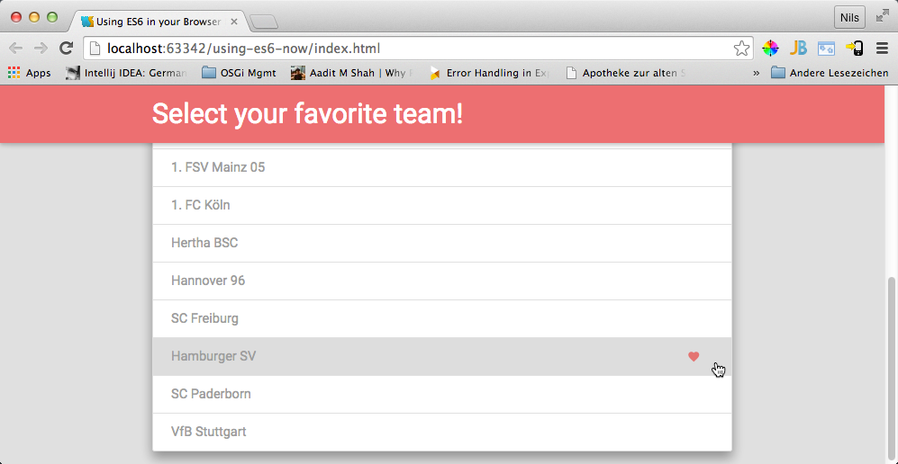

ES6 Module Example
==================
This is an example of how to use [Babel](https://babeljs.io) to enable ES6 features, including ES6 modules, in your browser. Using Babel you can choose
whether you want to transpile your ES6 files on the fly at [runtime transpiler](http://babeljs.io/docs/usage/browser/) (useful for development, rapid prototyping etc) or at [build time](http://babeljs.io/docs/using-babel/#build-systems) (recommended for production use).
The following  examples address both use cases.

The example app
---------------
The example app is a single HTML page containing a single component that allows a user to select it's favorite soccer team. It's neither complex nor
creative but should be enough to demonstrate some of the new ES6 features and how to enable them in browser.

Example branches
----------------

There are four branches demonstrating different use cases. You can compare the examples by [comparing the individual branches](https://github.com/nilshartmann/using-es6-now/compare):

* [`01-Babel_Runtime_No_Modules`](https://github.com/nilshartmann/using-es6-now/tree/01-Babel_Runtime_No_Modules): This branch uses no modules but only one single ES6 JavaScript file. This file gets transpiled at runtime (no compilation necessary)
* [`02-Babel_Runtime_ES6_Modules`](https://github.com/nilshartmann/using-es6-now/tree/02-Babel_Runtime_ES6_Modules): Here we separate the app's logic into four ES6 modules, that still are transpiled at runtime. ES6 Module support is enabled by [SystemJS](https://github.com/systemjs/systemjs) and [es6-module-loader.js](https://github.com/ModuleLoader/es6-module-loader)
* [`03-Babel_CompileTime_ES6_Modules`](https://github.com/nilshartmann/using-es6-now/tree/03-Babel_CompileTime_ES6_Modules): Same as branch `02` but transpiling the ES6 files using Gulp (no transpiling at runtime in your browser anymore). In order to run this example please execute `gulp` to run babel. Then open index.html in your browser.
* [`33-Babel_CompileTime_React_ES6_Modules`](https://github.com/nilshartmann/using-es6-now/tree/33-Babel_CompileTime_React_ES6_Modules): Based on example `03` but using [React](https://http://facebook.github.io/react/) as view engine.
Before running an example please checkout the branch you want and then run `npm install` to install babel (and gulp for branch `03` and `33`).

To run example `01` and `02` you than should start a webserver (i.e. from WebStorm) and open `index.html`.
For example `03` and `33` please run `gulp`. The included gulp config file will compile the ES6 files (and watches for changes to them). Then start a webserver and open `index.html`

Please feel free to send me comments or questions.

Resources
---------

* [ECMAScript 6 modules: the final syntax](http://www.2ality.com/2014/09/es6-modules-final.html)
* [JavaScript Modules the ES6 Way](http://24ways.org/2014/javascript-modules-the-es6-way/)

